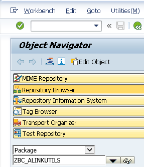
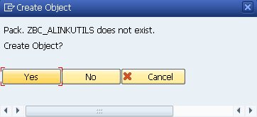
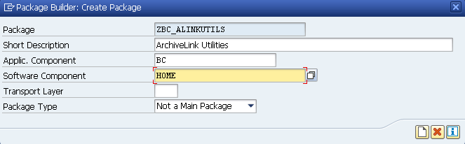
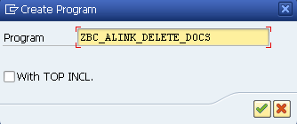
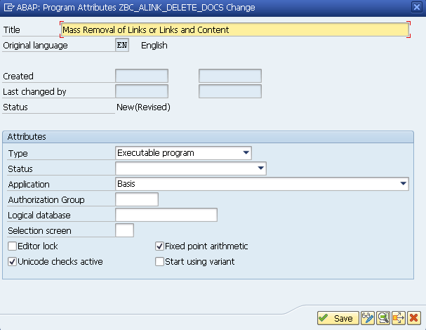
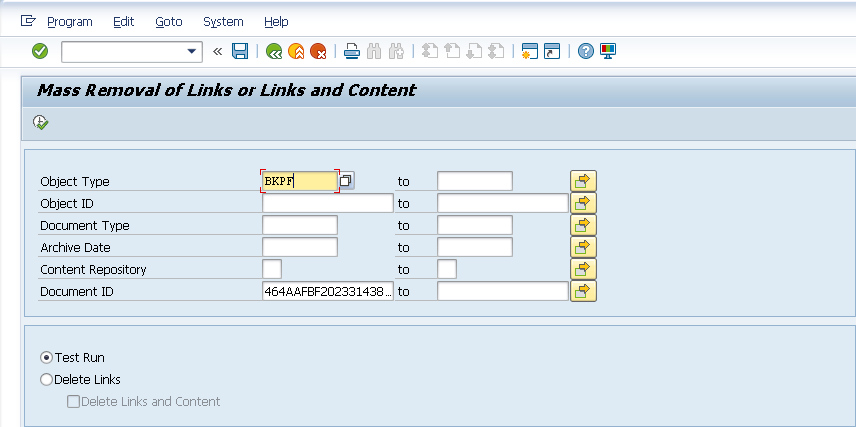
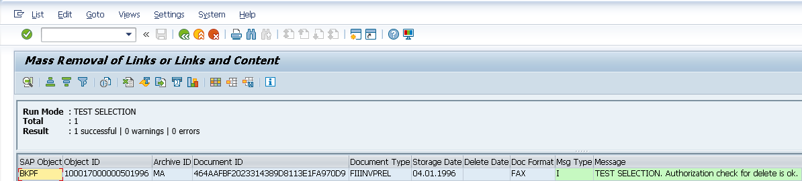
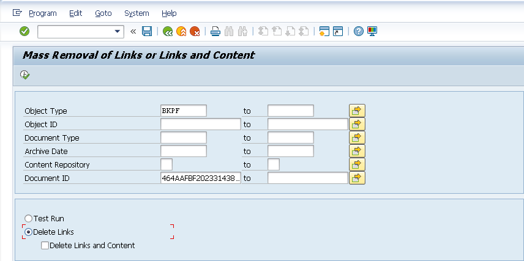
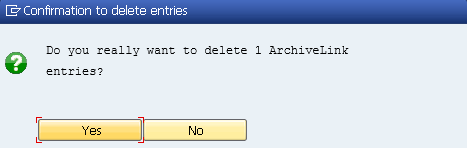
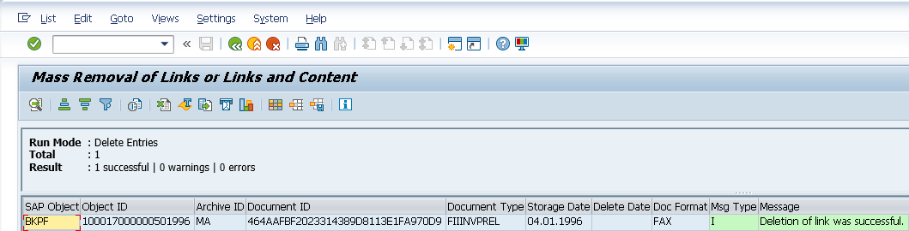

# Mass Removal of Links or Links and Content

## Description
This utility program deletes SAP ArchiveLink&#174; entries from the SAP ArchiveLink&#174; data tables(TOAXX) based on selection criteria. In addition to removing the records from the tables, it can also remove the content objects from the repository on which they are stored.

## Use Cases
+ After a system refresh (through a system restore) of a production system to a lower environment, it is recommended that data be cleansed in order to remove risk of inappropriate access to productive data and/or removal of erroneous data.

## Requirements
+ Netweaver&#174; ABAP&#174; Stack &ge; 7.0 (Note: not tested with lower releases, but may work.)
+ Developer Access and Authorization
+ Special Notes -[Notes](#h_add)

## Installation
At a minimum the installation of the _**Core**_ components listed below is required. If desired, an optional installation step can be taken in order to create a custom transaction code to allow the utility to be called directly.

### Core
1. Execute TC _**SE80**_.
<table>
	<tr>
		<td></td>
	</tr>
</table>
2. Find or Create a package "_**ZBC_ALINKUTILS**_".
<table>
	<tr>
		<td>Find or Create:</td>
		<td></td>
	</tr>
	<tr>
		<td>Create Step 1:</td>
		<td></td>
	</tr>
	<tr>
		<td>Create Step 2:</td>
		<td></td>
	</tr>
</table>
3. Create a new program with the name "_**ZBC_ALINK_DELETE_DOCS**_" in package "_**ZBC_ALINKUTILS**_".
<table>
	<tr>
		<th>Step</th>
		<th>Screenshot</th>
	</tr>
	<tr>
		<td>1</td>
		<td></td>
	</tr>
	<tr>
		<td>2</td>
		<td></td>
	</tr>
</table>
4. Copy the contents of the file ["_**zbc_alink_delete_docs.abap**_"](../blob/master/AlinkDeleteDocs/ZBC_ALINK_DELETE_DOCS.abap) to the newly created program.
5. Save and Activate the program.

### Optional (Z-TCode)
1. Execute TC _**SE80**_.
2. Find or Create a package "_**ZBC_ALINKUTILS**_".
3. Create a new transaction code with the name "_**ZBC_DALINK**_" and assign the program "_**ZBC_ALINK_DELETE_DOCS**_" as the target.

## Usage ##
There are two modes in which the utility can be executed _**Test**_ and _**Delete**_.
+ Test Selection
<table>
	<tr>
		<th>Step</th>
		<th>Screenshot</th>
	</tr>
	<tr>
		<td>Add Criteria:
			<ol>
				<li>Selection
					<ul>
						<li>Object Type</li>
						<li>Object ID</li>
						<li>Document Type</li>
						<li>Archive Date</li>
						<li>Content Repository</li>
						<li>Document ID</li>
					</ul>
				</li>
				<li>Run Mode
					<ul>
						<li>Test Run</li>
					</ul>
				</li>
			</ol>
			 Execute
		</td>
		<td></td>
	</tr>
	<tr>
		<td>Result:</td>
		<td></td>
	</tr>
</table>
+ Delete Entries
<table>
	<tr>
		<th>Step</th>
		<th>Screenshot</th>
		</tr>
	<tr>
		<td>Add Criteria:
			<ol>
				<li>Selection
					<ul>
						<li>Object Type</li>
						<li>Object ID</li>
						<li>Document Type</li>
						<li>Archive Date</li>
						<li>Content Repository</li>
						<li>Document ID</li>
					</ul>
				</li>
				<li>Run Mode
					<ul>
						<li>Delete Links
							<ul>
								<li>Delete Links and Content</li>
							</ul
						</li>
					</ul>
				</li>
			</ol>
			 Execute
		</td>
		<td></td>
	</tr>
	<tr>
		<td>Confirm Delete:</td>
		<td></td>
	</tr>
	<tr>
		<td>Result:</td>
		<td></td>
	</tr>
</table>

## Additional
<table>
	<tr>
		<th>Notes</th>
		<th>Details</th>
	</tr>
	<tr>
		<td>01</td>
		<td>This program should not be used in a productive SAP system.
			Data Archiving for the ArchiveLink entries should be used according to SAP Note 1900309 - HowTo: Archiving ArchiveLink connection entries. See also SAP Help https://help.sap.com/saphelp_erp60_sp/helpdata/en/b0/8a5a56eb0811d195580000e82deb58/content.htm</td>
	</tr>
	<tr>
		<td>02</td>
		<td>If enhanced ArchiveLink file attributes (table TOAAT) are used (SAP Note 1451769 : Enhancement in Archivelink file attributes in GOS scenario) then it is recommended to apply SAP Note “2166788 - Additional file attributes get deleted when deleting an attachment in archivelink even if more than one link entries are present for the same physical document”.</td>
	</tr>
</table>

## License
The Apache License v2.0 is used for all development objects. 
[Apache License](../blob/master/AlinkDeleteDocs/LICENSE)